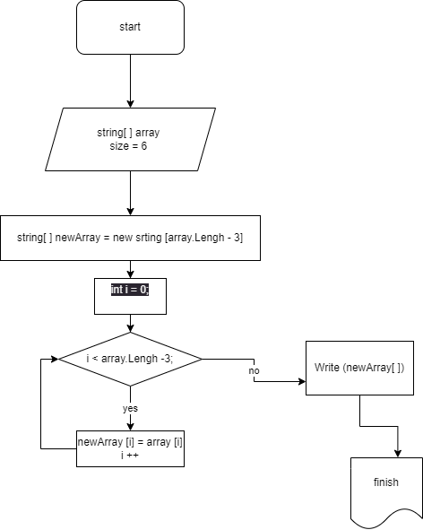

###**алгоритм решения задачи**
* задать массив из строк
* преобразовать данный массив в новый массив из строк, длина которых меньше, либо равна 3 символам. 
>> Первоначальный массив можно ввести с клавиатуры, либо задать на старте выполнения алгоритма. 

 ***Примеры:***
1. *[“Hello”, “2”, “world”, “:-)”] → [“2”, “:-)”]*
2. *[“1234”, “1567”, “-2”, “computer science”] → [“-2”]*
3. *[“Russia”, “Denmark”, “Kazan”] → []*

 